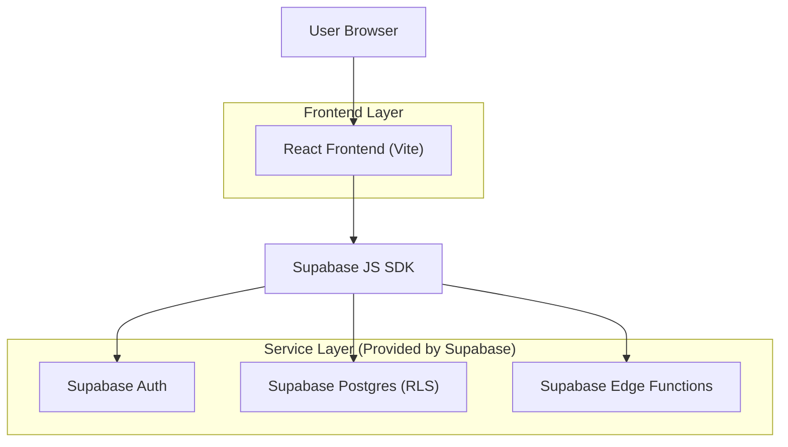
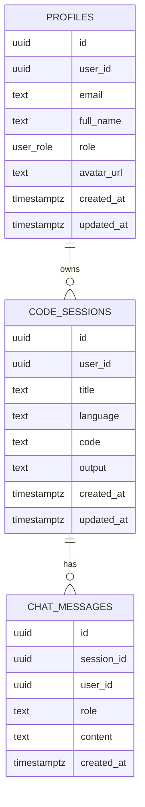

## 1.Architecture design


## 2.Technology Description
- Frontend: React@18 + react-router-dom@6 + tailwindcss@3 + shadcn/ui (Radix UI) + vite@5
- Backend: Supabase (Auth, Postgres, Edge Functions)

## 3.Route definitions
| Route | Purpose |
|-------|---------|
| / | Public landing page (marketing + CTA into Auth/App) |
| /auth | Sign in / sign up (Supabase Auth) |
| /create-project | Project template selection (requires auth) |
| /app | IDE workspace (requires auth) |
| * | Not found |

## 4.API definitions (If it includes backend services)
### 4.1 Supabase Edge Functions (called from frontend)
- `POST /functions/v1/execute-code` (execute user code and return output)
- `POST /functions/v1/guide-ai` (Guide-AI chat / coaching responses)

## 6.Data model(if applicable)
### 6.1 Data model definition


### 6.2 Data Definition Language
Profiles (profiles)
```
CREATE TABLE public.profiles (
  id UUID PRIMARY KEY DEFAULT gen_random_uuid(),
  user_id UUID NOT NULL UNIQUE,
  email TEXT NOT NULL,
  full_name TEXT,
  role public.user_role NOT NULL DEFAULT 'learner',
  avatar_url TEXT,
  created_at TIMESTAMPTZ NOT NULL DEFAULT now(),
  updated_at TIMESTAMPTZ NOT NULL DEFAULT now()
);
```
