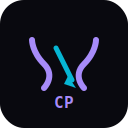

# CodePath AI Coach

<div align="center">
  
  <h3>AI-Powered Development Environment</h3>
  <p>Build, explain, and execute code with multi-language support and VSCode-style Explorer</p>
</div>

## ✨ Features

### 🧠 AI Assistant
- **Multiple AI Providers**: Choose between OpenAI, Claude, Gemini, or local models
- **Dual Modes**: Switch between **Explain** (code walkthroughs) and **Create** (generate files/apps)
- **Real-time Streaming**: Chat with your AI assistant while coding

### 💻 VSCode-Style Explorer
- **Folder Tree View**: Expand/collapse folders with chevron navigation
- **Search Filter**: Quickly find files with auto-expand results
- **Context Actions**: Right-click for new file/folder, rename, delete
- **Toolbar Actions**: New file, new folder, collapse all
- **Multi-file Workspace**: Open multiple files in tabs with persistence

### 🚀 Multi-Language Execution
- **Judge0 Integration**: Run Python, Java, C++, C, Go, Rust, and more
- **Local JavaScript Fallback**: Instant JS execution without external services
- **Real-time Output**: Stream execution results in the terminal panel

### 🎨 Modern Dark Theme
- **Deep Black Palette**: Consistent dark theme across all panels
- **High Contrast**: Optimized for long coding sessions
- **Responsive Design**: Works on desktop and tablet screens

### 💾 Workspace Persistence
- **Auto-save**: Files, tabs, and active editor state saved to localStorage
- **Session Restore**: Pick up where you left off after reload
- **Language Detection**: Automatic syntax highlighting based on file extension

## 🛠️ Tech Stack

- **Frontend**: React 18 + TypeScript
- **Build Tool**: Vite
- **UI Components**: shadcn/ui + Radix UI
- **Styling**: Tailwind CSS
- **Editor**: Monaco Editor (VS Code editor)
- **Execution**: Judge0 API + Supabase Edge Functions
- **AI**: OpenAI/Claude/Gemini/Local LLMs

## 🚀 Quick Start

### Prerequisites
- Node.js 18+ and npm
- Git

### Installation

```bash
# Clone the repository
git clone https://github.com/Muneerali199/code-path-ai.git
cd code-path-ai

# Install dependencies
npm install

# Start development server
npm run dev
```

The app will be available at `http://localhost:5173`

### Environment Variables

Create a `.env` file in the root directory:

```env
# Supabase (required for AI chat and code execution)
VITE_SUPABASE_URL=your_supabase_url
VITE_SUPABASE_PUBLISHABLE_KEY=your_supabase_key

# Judge0 (optional - for multi-language execution)
JUDGE0_URL=https://judge0-ce.p.rapidapi.com
JUDGE0_API_KEY=your_judge0_api_key

# AI Providers (optional - depending on chosen provider)
VITE_OPENAI_API_KEY=your_openai_key
VITE_ANTHROPIC_API_KEY=your_claude_key
VITE_GEMINI_API_KEY=your_gemini_key
```

## 📖 Usage

### 1. File Explorer
- **Create Files**: Click the `+` icon or right-click → New File
- **Create Folders**: Click the folder icon or right-click → New Folder
- **Rename**: Right-click → Rename or select file and click pencil icon
- **Delete**: Right-click → Delete or select file and click trash icon
- **Search**: Use the search box to filter files and auto-expand folders

### 2. Code Editor
- **Multi-file Tabs**: Open multiple files, tabs persist across sessions
- **Syntax Highlighting**: Automatic based on file extension
- **Run Code**: Click Run button or use shortcut to execute
- **Language Detection**: Editor automatically detects file language

### 3. AI Assistant
- **Switch Provider**: Use the dropdown to select AI model
- **Toggle Mode**: Choose between Explain and Create modes
- **Chat**: Type questions about your code or request new features
- **Streaming**: Real-time responses as the AI generates content

### 4. Code Execution
- **JavaScript**: Runs locally without configuration
- **Other Languages**: Uses Judge0 API (requires API key)
- **Output**: Results appear in the terminal panel below the editor

## 🏗️ Project Structure

```
src/
├── components/
│   ├── ide/           # IDE-specific components
│   │   ├── EditorTabs.tsx
│   │   ├── FileExplorer.tsx
│   │   └── StatusBar.tsx
│   ├── ui/            # shadcn/ui components
│   ├── chat/          # AI chat interface
│   ├── editor/        # Monaco editor wrapper
│   └── layout/        # Main IDE layout
├── hooks/             # Custom React hooks
├── lib/               # Utilities and configurations
└── types/             # TypeScript type definitions
```

## 🔧 Development

### Available Scripts

```bash
npm run dev      # Start development server
npm run build    # Build for production
npm run preview  # Preview production build
npm run lint     # Run ESLint
```

### Adding New AI Providers

1. Add provider to `src/lib/ai-providers.ts`
2. Update the provider selector in `src/components/chat/GuideAIChat.tsx`
3. Add environment variable to `.env.example`

### Adding New Languages

1. Add language ID to `src/lib/language-map.ts`
2. Update Judge0 integration in `supabase/functions/execute-code/index.ts`
3. Add default code template in `src/components/layout/IDELayout.tsx`

## 🤝 Contributing

1. Fork the repository
2. Create a feature branch: `git checkout -b feature-name`
3. Commit your changes: `git commit -m "Add feature description"`
4. Push to the branch: `git push origin feature-name`
5. Open a Pull Request

## 📄 License

This project is licensed under the MIT License - see the [LICENSE](LICENSE) file for details.

## 🙏 Acknowledgments

- [Monaco Editor](https://microsoft.github.io/monaco-editor/) - The code editor that powers VS Code
- [Judge0](https://judge0.com/) - Online code execution system
- [shadcn/ui](https://ui.shadcn.com/) - Beautiful UI components
- [Tailwind CSS](https://tailwindcss.com/) - Utility-first CSS framework
- [Supabase](https://supabase.com/) - Backend as a Service

---

<div align="center">
  <p>Built with ❤️ by the CodePath AI team</p>
</div>
